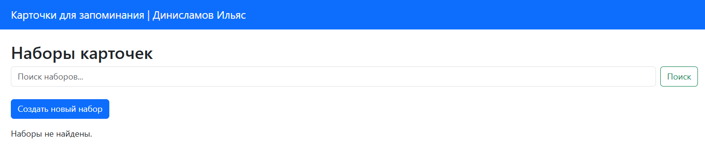
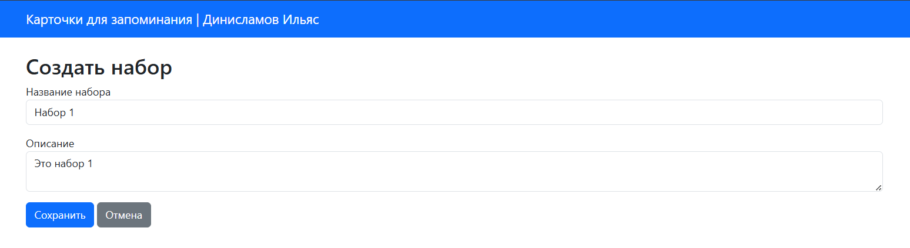
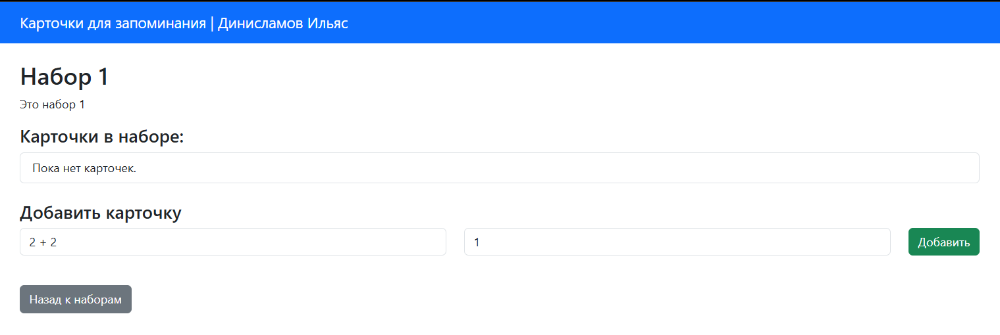
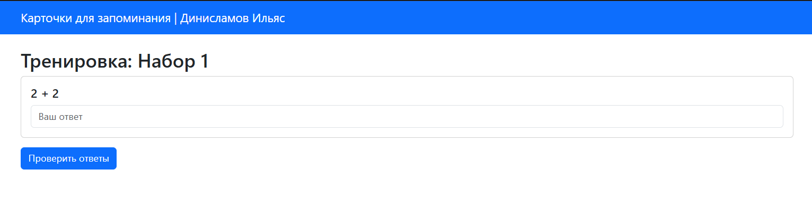
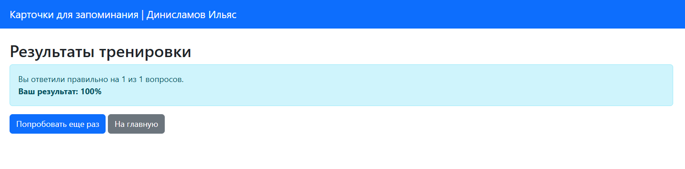

# Инструкция для пользователя
1. **Главная страница:** Здесь отображается список всех созданных наборов. Вы можете воспользоваться строкой поиска.

2. **Создание набора:** Нажмите "Создать новый набор", введите название и сохраните.

3. **Добавление карточек:** Откройте набор кнопкой "Открыть" и воспользуйтесь формой добавления вопроса и ответа.

4. **Тренировка:** Нажмите "Тренировка" на карточке набора. Введите ваши варианты ответов на все карточки и нажмите "Проверить ответы", чтобы узнать свой результат.

